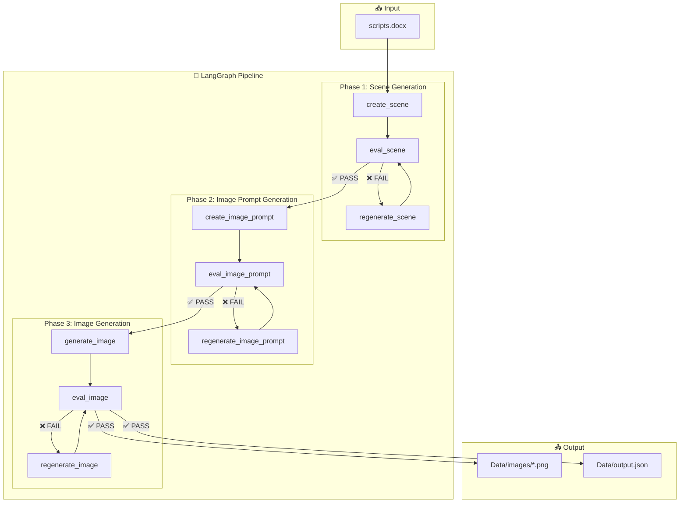
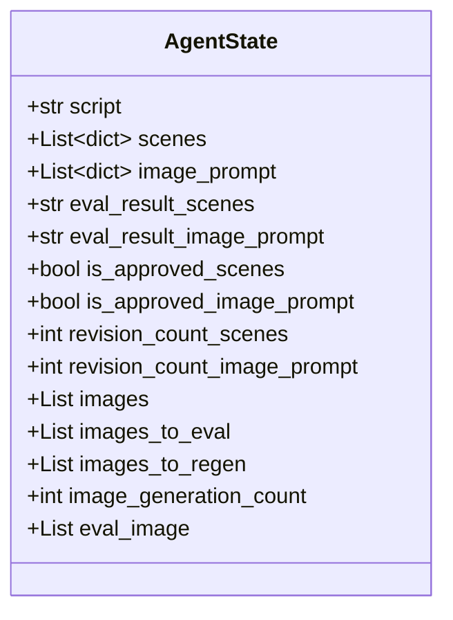

# Video Generation Pipeline - Project Flow

## Overview

This project transforms a **text script** into a sequence of **AI-generated images** using a LangGraph-based agentic workflow with iterative quality checks.

---

## High-Level Architecture



---

## Detailed Node Descriptions

### Phase 1: Scene Generation

| Node | File | Description |
|------|------|-------------|
| `create_scene` | [scene_creator_node.py](file:///c:/Stack%20overflow/video_generation/Utils/nodes/scene_creator_node.py) | Breaks script into visual scenes with location, time, characters |
| `eval_scene` | [eval_scene_node.py](file:///c:/Stack%20overflow/video_generation/Utils/nodes/eval_scene_node.py) | Validates scenes for visual clarity and consistency |
| `regenerate_scene` | [regenerate_scene_node.py](file:///c:/Stack%20overflow/video_generation/Utils/nodes/regenerate_scene_node.py) | Fixes rejected scenes based on feedback |

---

### Phase 2: Image Prompt Generation

| Node | File | Description |
|------|------|-------------|
| `create_image_prompt` | [image_prompt_node.py](file:///c:/Stack%20overflow/video_generation/Utils/nodes/image_prompt_node.py) | Converts scenes to detailed image generation prompts |
| `eval_image_prompt` | [eval_image_prompt_node.py](file:///c:/Stack%20overflow/video_generation/Utils/nodes/eval_image_prompt_node.py) | Checks prompt quality and consistency |
| `regenerate_image_prompt` | [regenerate_image_prompt_node.py](file:///c:/Stack%20overflow/video_generation/Utils/nodes/regenerate_image_prompt_node.py) | Improves rejected prompts |

---

### Phase 3: Image Generation

| Node | File | Description |
|------|------|-------------|
| `generate_image` | [image_generation_node.py](file:///c:/Stack%20overflow/video_generation/Utils/nodes/image_generation_node.py) | Calls image generation API (Modal/Pollinations) |
| `eval_image` | [eval_image_node.py](file:///c:/Stack%20overflow/video_generation/Utils/nodes/eval_image_node.py) | Uses Gemini Vision to QA generated images |
| `regenerate_image` | [regenerate_image_node.py](file:///c:/Stack%20overflow/video_generation/Utils/nodes/regenerate_image_node.py) | Re-generates failed images with corrected prompts |

---

## State Object

The workflow maintains the following state throughout execution:



---

## Configuration Files

All configurable values are stored in `input/`:

| Config File | Controls |
|-------------|----------|
| [scene_creator_config.json](file:///c:/Stack%20overflow/video_generation/input/scene_creator_config.json) | Scene count, density, required fields |
| [image_prompt_config.json](file:///c:/Stack%20overflow/video_generation/input/image_prompt_config.json) | Visual style, negative prompts, pro tips |
| [eval_scene_config.json](file:///c:/Stack%20overflow/video_generation/input/eval_scene_config.json) | Evaluation rules for scenes |
| [eval_image_config.json](file:///c:/Stack%20overflow/video_generation/input/eval_image_config.json) | Pass threshold, fail conditions |
| [eval_image_prompt_config.json](file:///c:/Stack%20overflow/video_generation/input/eval_image_prompt_config.json) | Prompt validation criteria |

---

## Running the Pipeline

```bash
# Activate virtual environment (if not using uv)
.\.venv\Scripts\activate

# Run the pipeline
uv run main.py
```

**Output:**
- Generated images → `Data/images/`
- Full state JSON → `Data/output.json`
